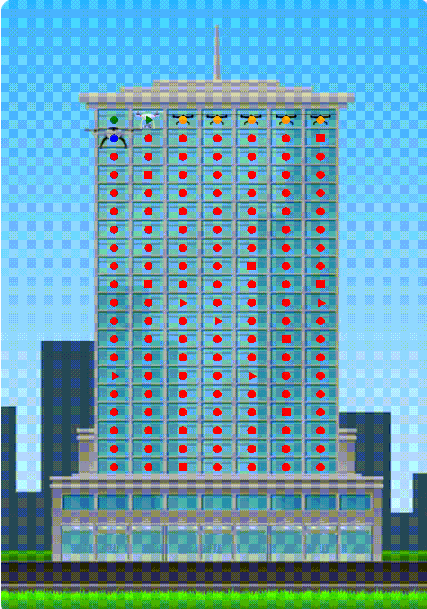

# Animation for Autonomous Drone Project
Animations for a multi-agent autonomous drone system where the drones clean skyscraper windows. This repository creates an animation for the basic cleaning of all the buildings' windows `cleaning_animatiom.py` and an animation of cleaning the buildings' windows with the verification scanner drones picking up on windows which are still dirty after initial cleaning `cleaning_animation_scanner.py`.

| Regular Cleaning | With Scanner Drone |
|--------------|-------------|
|  |  |

